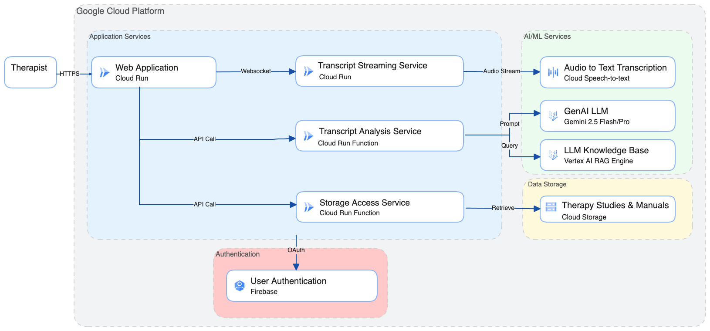

# Ther-Assist: Real-time Therapy Guidance System

Ther-Assist is a generative AI multimodal tool designed to help psychotherapists deliver personalized, evidence-based treatments (EBTs) for anxiety and depression. It provides real-time feedback to help assess patients, guide treatment decision-making, and evaluate progress.

## Overview

Ther-Assist listens ambiently to therapy sessions and provides near real-time guidance based on evidence-based treatment manuals and protocols. The system uses Google Cloud services and Gemini 2.5 Flash to analyze therapy conversations and suggest interventions, pathway changes, and therapeutic techniques.

## Features

- **Real-time Transcription**: Ambient listening with speaker diarization (therapist vs patient)
- **Live Analysis**: Continuous analysis of therapy segments with EBT-based recommendations
- **Critical Alerts**: Immediate notifications for safety concerns or important pathway changes
- **Session Metrics**: Track engagement, therapeutic alliance, and emotional states
- **Evidence-Based Guidance**: References to specific manual sections and treatment protocols
- **Pathway Monitoring**: Suggests alternative approaches when current methods aren't effective

## Architecture

### Diagram


### Frontend (React + Vite)
- **Clinician-Optimized UI**: Large, readable alerts with visual priority system
- **Live Transcript Display**: Real-time speaker-labeled conversation
- **Alert System**: Critical (red), Suggestion (yellow), Info (green) alerts
- **Session Metrics Dashboard**: Visual indicators for therapeutic progress

### Backend Services
1. **Streaming Transcription Service** (`backend/streaming-transcription-service/`)
   - FastAPI WebSocket service deployed on Cloud Run
   - Uses Google Cloud Speech-to-Text V2 API
   - Real-time audio streaming with low latency
   - Optimized for therapy conversations

2. **Therapy Analysis Service** (`backend/therapy-analysis-function/`)
   - Uses Gemini 2.5 Flash with thinking mode
   - RAG integration with EBT corpus
   - Provides real-time therapeutic guidance
   - Generates session summaries

## Deployment Instructions

### Prerequisites
- Node.js 18+ and npm
- Google Cloud Project with billing enabled
- Google Cloud CLI (`gcloud`) installed and authenticated

### Initial GCP & Firebase Setup

1. Enable APIs
```bash
# Set your project ID
gcloud init
gcloud auth application-default login

# Enable required APIs
gcloud services enable speech.googleapis.com
gcloud services enable aiplatform.googleapis.com
gcloud services enable discoveryengine.googleapis.com
gcloud services enable generativelanguage.googleapis.com
gcloud services enable artifactregistry.googleapis.com
gcloud services enable cloudbuild.googleapis.com
gcloud services enable run.googleapis.com
gcloud services enable cloudfunctions.googleapis.com
gcloud services enable compute.googleapis.com
gcloud services enable storage.googleapis.com
```

2. Enable Firebase Authentication
- Search for Firebase in your GCP project. Click into Firebase Authenticaiton, and click into the Firebase Portal
- Enable Google Authentication within Firebase
- Go to your project settings, enable a web application, and grab the Firebase config object. It should look like this:
```javascript
{
  apiKey: "api-key",
  authDomain: "your-gcp-project.firebaseapp.com",
  projectId: "your-gcp-project",
  storageBucket: "your-gcp-project.firebasestorage.app",
  messagingSenderId: "message-sender-id",
  appId: "1:app-id"i
}
```
3. Create a file in frontend/firebase-config-object.ts like this:
```javascript
export const firebaseConfig = {
  apiKey: "api-key",
  authDomain: "your-gcp-project.firebaseapp.com",
  projectId: "your-gcp-project",
  storageBucket: "your-gcp-project.firebasestorage.app",
  messagingSenderId: "message-sender-id",
  appId: "1:app-id"i
};
```
4. Also create a file in frontend/.firebaserc like this:
```json
{
  "projects": {
    "default": "you-gcp-project"
  }
}
```
5. Grant you default compute engine service account project editor access

### Deploy Services

1. Create RAG Corpuses
Follow the instructions in the [RAG README.MD](./setup_services/rag/README)

2. Deploy Cloud Run & Cloud Run Functions using Terraform
- Set up Terraform variables:
```bash
cd terraform
cp terraform.tfvars.example terraform.tfvars
```
- Edit `terraform.tfvars` with your values
- Initialize and deploy:
```bash
terraform init
terraform plan
terraform apply
```

3. Go back to Firebase settings and allowlist authentication for every single domain in the backend and for your frontend domain

4. Go to each deployed step and enable unauthorized access for each (manual step due to org policies)

## Local Dev
Note: if you haven't completed deployments then you'll need to update .env values manually

### Backend therapy-analysis-function
1. Navigate to the directory
```bash
cd backend/therapy-analysis-function
```
2. Configure your venv & install dependencies
```bash
python3 -m venv .venv
source .venv/bin/activate
pip install -r requirements.txt
```
3. Run the Cloud Run Function locally
```bash
functions-framework --target=therapy_analysis --port=8080
```

### Backend storage-access-function
1. Navigate to the directory
```bash
cd backend/storage-access-function
```
2. Configure your venv & install dependencies
```bash
python3 -m venv .venv
source .venv/bin/activate
pip install -r requirements.txt
```
3. Run the Cloud Function locally
```bash
functions-framework --target=storage_access --port=8081
```

### Backend streaming-transcription-service
1. Navigate to the directory
```bash
cd backend/streaming-transcription-service
```
2. Configure your venv & install dependencies
```bash
python3 -m venv .venv
source .venv/bin/activate
pip install -r requirements.txt
```
3. Be sure to update the .env file so that the port is 8082 

4. Run the service locally
```bash
python main.py
```

### Frontend
1. Create .env.development & update with your own values
```bash
cd frontend
cp .env.example .env.development
```

2. Install dependencies and run frontend
```bash
cd frontend
npm i
npm run dev
```

## Security & Privacy

- All audio processing happens in memory
- Sessions are not stored by default
- HIPAA compliance considerations:
  - Deploy in HIPAA-compliant GCP region
  - Enable VPC Service Controls
  - Use Customer-Managed Encryption Keys (CMEK)
  - Implement proper access controls

## License

This project is licensed under the MIT License - see LICENSE file for details.

## Acknowledgments

- SUNY for supporting this research
- Google Cloud for AI/ML infrastructure
- Evidence-based treatment manual authors

